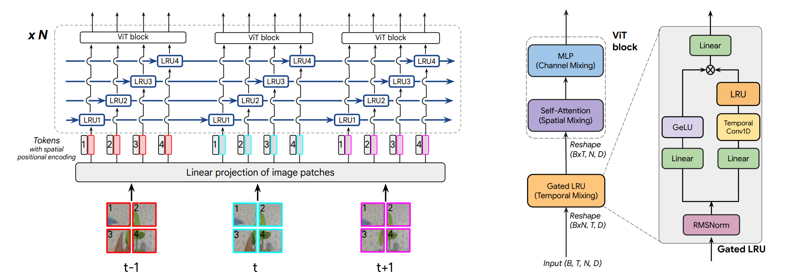

<!-- mdlint off(LINE_OVER_80) -->
# [TRecViT](https://arxiv.org/abs/2412.14294)

Welcome to the Google DeepMind Github repository for TRecViT, a novel architecture for efficient video modelling.

TRecViT proposes a new factorisation that relies on gated linear recurrent
units (LRUs) for mixing information over time, self-attention for mixing information over space,
and MLPs for mixing over channels. This architecture achieves SOTA results on SSv2 when compared to causal models and outperforms or is competitive with non-causal vanilla Transformers on SSv2 and Kinetics400, while having significantly less parameters and smaller memory footprint and FLOPs count.

The model can be trained in supervised or self-supervised regimes (e.g. masked auto-encoding).

TrecViT Paper: https://arxiv.org/abs/2412.14294



## Installation

```bash
# create environment (requires python>=3.10.0)
python3 -m venv trecvit_env
source trecvit_env/bin/activate

# get repo
git clone https://github.com/google-deepmind/trecvit.git
cd trecvit

pip install .
```

Test the installation by importing our model:

```bash
from trecvit import trecvit_model
model = trecvit_model.get_model()
```

This module depends on the [recurrent_gemma](https://github.com/google-deepmind/recurrentgemma) library. It also uses forked files from [big_vision](https://github.com/google-research/big_vision).

## Usage

Please check the quickstart colab to see how to instantiate the model and run inference.

[](https://colab.research.google.com/github/deepmind/trecvit/blob/main/colabs/trecvit_demo.ipynb)

## Pretrained Checkpoints

We release pretrained checkpoints for supervised classification using TRecViT-B on Kinetics400:
https://storage.mtls.cloud.google.com/trecvit/model_checkpoints/trecvit_B_k400.npz

Additional checkpoints could be released in the future if requested.

## Citing this work

To cite our work, please use:

```
@misc{pătrăucean2024trecvitrecurrentvideotransformer,
      title={TRecViT: A Recurrent Video Transformer},
      author={Viorica Pătrăucean and Xu Owen He and Joseph Heyward and Chuhan Zhang and Mehdi S. M. Sajjadi and George-Cristian Muraru and Artem Zholus and Mahdi Karami and Ross Goroshin and Yutian Chen and Simon Osindero and João Carreira and Razvan Pascanu},
      year={2024},
      eprint={2412.14294},
      archivePrefix={arXiv},
      primaryClass={cs.CV},
      url={https://arxiv.org/abs/2412.14294},
}
```

## License and disclaimer

Copyright 2025 Google LLC

All software is licensed under the Apache License, Version 2.0 (Apache 2.0); you may not use this file except in compliance with the Apache 2.0 license. You may obtain a copy of the Apache 2.0 license at: https://www.apache.org/licenses/LICENSE-2.0

All other materials are licensed under the Creative Commons Attribution 4.0 International License (CC-BY). You may obtain a copy of the CC-BY license at: https://creativecommons.org/licenses/by/4.0/legalcode

Unless required by applicable law or agreed to in writing, all software and materials distributed here under the Apache 2.0 or CC-BY licenses are distributed on an "AS IS" BASIS, WITHOUT WARRANTIES OR CONDITIONS OF ANY KIND, either express or implied. See the licenses for the specific language governing permissions and limitations under those licenses.

This is not an official Google product.
